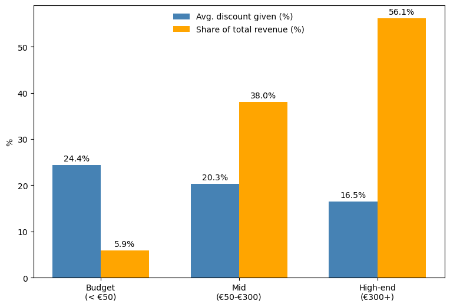
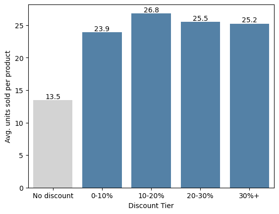

# Eniac's Discount Strategy

A data analysis of Eniac's online store sales, built to answer one question: **is discounting actually working, and how should it change?**

Full presentation: [`presentation/Eniac_Discount_Strategy.pdf`](presentation/Eniac_Discount_Strategy.pdf)

## Recommendation

Eniac should keep discounting, but with more discipline than it runs today:

1. **Cap standard discounts at 20%.** Sales stop climbing past that point - deeper cuts just give away margin for nothing.
2. **Rebalance discount toward high-end products, away from budget items.** Budget items get the biggest discount (24.4%) but bring in only 5.9% of revenue; high-end items are barely discounted (16.5%) yet bring in 56.1%.
3. **Plan campaigns around the calendar.** November (Black Friday) was the best month of the year on orders and average order value - without running the year's highest discount.

## Data pipeline

Raw exports (`orders.csv`, `orderlines.csv`, `products.csv`) go through a cleaning pass per table, then get joined for the discount analysis.

| Notebook | What it does |
|---|---|
| [`notebooks/01_clean_orders.ipynb`](notebooks/01_clean_orders.ipynb) | Cleans `orders.csv`: fixes date types, drops the handful of rows with missing `total_paid`, trims stray whitespace from `state`. Outputs `orders.clean.csv`. |
| [`notebooks/02_clean_orderlines.ipynb`](notebooks/02_clean_orderlines.ipynb) | Cleans `orderlines.csv`: fixes malformed `unit_price` text (double decimal points), drops the lines that couldn't be recovered, parses dates. |
| [`notebooks/03_clean_products.ipynb`](notebooks/03_clean_products.ipynb) | Cleans `products.csv`: drops 8,746 exact duplicate rows, dedupes by SKU, fills missing `desc`/`type`, and fixes malformed `price`/`promo_price` text. Outputs `product_clean_1.csv`. |
| [`notebooks/04_discount_analysis.ipynb`](notebooks/04_discount_analysis.ipynb) | The actual analysis: computes discount % and revenue per orderline, segments products into price tiers, and builds the charts behind the recommendation above. |


## Key charts

**Discount is pointed at the wrong tier** - budget products get the deepest discount but bring in the least revenue; high-end products get barely any discount yet drive over half of revenue.



**Seasonality drives sales more than discount depth does** - November 2017 (Black Friday) had the most orders and the highest average order value of the year, at a discount (22%) that wasn't even the year's deepest.


**A bigger discount doesn't sell more** - any discount roughly doubles average units sold vs. no discount at all, but going deeper than that barely moves the number. 

<p align="center"></p>


## Repo structure

```
.
├── README.md
├── notebooks/            # cleaning + analysis
├── plots/                # the three charts referenced above
└── presentation/         # the full presentation
```
